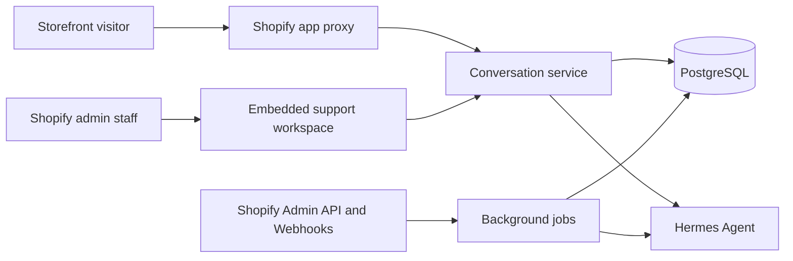

# Shopify AI Customer Service

面向 Shopify 独立站的 AI 客服与人工协作应用。项目将店铺商品、访客会话、Hermes Agent 和客服工作台连接起来，让 AI 先处理商品咨询与推荐，无法解决时由人工接管，并把处理记录沉淀为可复用的服务流程。

## 核心能力

- **三方会话**：统一管理访客、AI 与客服消息，支持 AI 开关、待处理/已处理状态、内部备注和标签。
- **商品推荐**：通过 Shopify Webhooks 同步商品快照，并将商品知识推送给 Hermes Agent。
- **人工接管**：客服可暂停 AI、直接回复、标记处理状态，并查看 AI 推荐商品与推荐理由。
- **可靠同步**：数据库后台任务、幂等写入、失败退避和最多五次重试，避免 Webhook 阻塞。
- **运营工作台**：提供会话筛选、商品同步状态、异常提醒及 Hermes 并发测试入口。
- **安全与合规**：访问限流、Bearer 保护的任务入口、应用卸载清理及 Shopify 强制隐私 Webhooks。

## 架构



## 技术栈

- Shopify Remix、React、TypeScript、Polaris
- Prisma、PostgreSQL
- Shopify Admin API、App Proxy、Webhooks
- Hermes Agent / OpenAI-compatible API
- Docker、Node test runner、ESLint、TypeScript

## 数据与可靠性设计

主要数据模型位于 [`prisma/schema.prisma`](prisma/schema.prisma)：

- `Conversation` / `Message` / `ConversationTag`：会话、消息、标签与人工接管状态。
- `ProductSnapshot`：商品快照及 Hermes 同步状态。
- `BackgroundJob`：异步任务、重试次数和下次执行时间。
- `ChatRateLimit`：访客侧访问频率控制。

商品 Webhook 只负责校验、快照写入和任务入队；实际同步由受保护的任务入口异步执行。重复事件通过业务唯一键和幂等更新处理。

## 本地运行

### 前置条件

- Node.js 20.19+ 或 22.12+
- PostgreSQL
- Shopify Partner 账号、开发店铺及 Shopify CLI
- 可选：Hermes Agent 兼容服务

### 配置

创建本地环境配置，并提供以下变量：

| 变量 | 用途 |
| --- | --- |
| `SHOPIFY_API_KEY` / `SHOPIFY_API_SECRET` | Shopify 应用认证 |
| `SHOPIFY_APP_URL` / `SCOPES` | 应用地址与权限范围 |
| `DATABASE_URL` / `DIRECT_URL` | Prisma 运行时与迁移连接 |
| `HERMES_BASE_URL` / `HERMES_API_KEY` | Hermes Agent 接口 |
| `BACKGROUND_JOB_SECRET` | 后台任务入口鉴权 |

不要提交真实密钥或生产数据。

### 启动

```bash
npm install
npm run setup
npm run dev
```

## 验证与部署

```bash
npm run verify
npm run test:hermes-concurrency
npm run deploy
```

`npm run verify` 会依次运行 ESLint、TypeScript 类型检查、自动化测试和生产构建。生产部署需使用持久化 PostgreSQL，并由可信调度器调用后台任务入口。

## 主要目录

```text
app/routes/       Shopify 后台、App Proxy、任务入口与 Webhooks
app/models/       会话和商品数据访问
app/services/     Hermes、限流、后台任务、隐私与业务服务
prisma/           PostgreSQL 数据模型与迁移
scripts/          Hermes 并发验证脚本
```

## 项目定位

该仓库用于展示 Shopify AI 客服的工程实现，包括会话闭环、Agent 集成、商品同步、人工接管和合规处理。生产环境配置、客户数据和业务专有信息不包含在仓库中。
